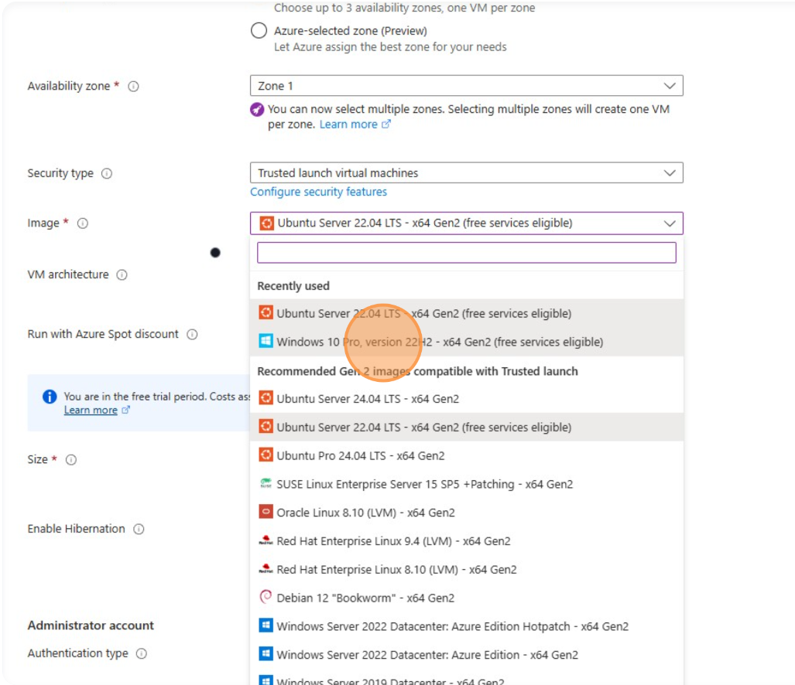
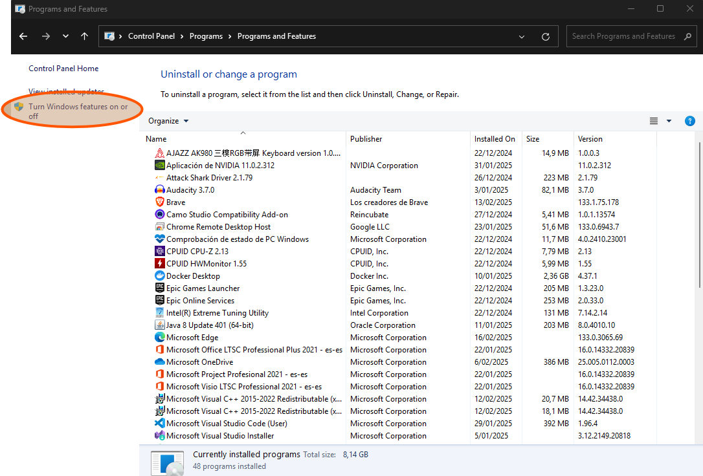
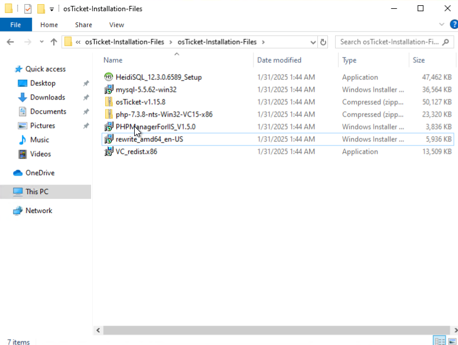
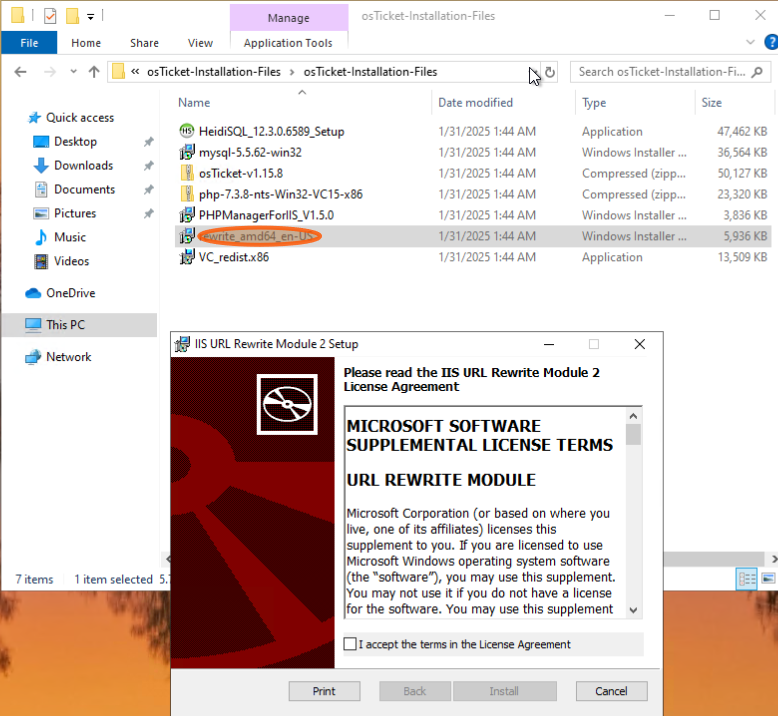

# 

 

<h1>osTicket: Prerequisites and Installation</h1>

<h2>Description</h2>

This project provides a comprehensive, step-by-step guide for implementing a scalable, open-source Help Desk solution using osTicket on Microsoft Azure. 

It covers creating a Windows 10 VM, configuring a full web server environment (IIS, MySQL, PHP), and overcoming technical challenges with PHP modules, IIS permissions, and configuration conflicts. 

The result is a documented process for creating a production-ready osTicket instance, demonstrating skills in system administration, web server configuration, and technical documentation. 

To facilitate reproducing this setup, all necessary installation files are available [here.](https://drive.usercontent.google.com/download?id=1b3RBkXTLNGXbibeMuAynkfzdBC1NnqaD&export=download&authuser=0) 
 

<h2>Environments and Utilities Used</h2>

- <b>Microsoft Azure</b>
- <b>Virtual Machines</b>
- <b>Remote Desktop Connection</b>
- <b>Internet Information Services</b>
- <b>MySQL</b>

<h2>Operating Systems Used </h2>

- <b>Windows 10</b>

<h2>Project Walk-through:</h2>

1. The first step is to navigate to the Microsoft Azure portal, which can be found at the following URL: https://portal.azure.com/#home  
 
 
   
2. Within the portal, locate the field entitled "Search resources, services, and docs (G+/)", and enter the search term "vm". Click on "Virtual machines" in the resulting list  
   

 
 

3. The following steps should be taken in order to create a virtual machine: firstly, click on "Create" > "Azure virtual machine".
   

 
 

4. Then, click on "Create new" > click on the "Name" field > type "osTicket" > click on "OK".

 
 

5. Assign a name to the VM by clicking on the "Virtual machine name" field and typing "osticket-vm".

 
 
    
6. Click on "Region settings" and select "East US 2".

 
 

7. Select the virtual machine image and choose the 'Windows 10 Pro, version 22H2 - x64 Gen2' option

 
 

8. Click on the field marked 'Username'. Here, a username must be typed and set up.
   

 
 

9. Click on the field marked 'Password' and then enter and set up a password.
 

 
 

10. Click on the 'Confirm Password' box and enter the password again

 
 

11. The 'Licensing' box must be selected.

 
 

12. Click on the option entitled 'Review + Create'.
 

 
 

13. Following the conclusion of the review process, the subsequent step is to click the "Create" button.

 
 

14. Navigate to the following URL: https://apps.microsoft.com/detail/9wzdncrfj3ps?hl=es=EN&gl=EN 

15. To establish a remote connection to the virtual machine, it is necessary to download this software to facilitate the process.

 
 

16. In the Azure Portal, click the search box, type VM, and click Virtual Machines

 
 

17. Identify the public IP address of our virtual machine ("74.249.118.131") and copy it by pressing [[ctrl]] + [[c]]

 
 

18. Open "Remote Desktop"

 
 

19. Click Add > Click PC to introduce our virtual machine information

 
 

20. Click on "Formal name or IP address" and paste the IP address using [[ctrl]] + [[v]]

 
 

21. Click the Display name section and enter a name for this PC

 
 

22. Save the information

 
 

23. Open your new PC

 
 

24. Enter the username and password assigned to your virtual machine during Azure configuration and click Connect.

 
 

25. Configuring the virtual machine windows

 
 

26. Open Microsoft Edge on the virtual machine

 
 

27. Download [osTicket-Installation-Files.zip](https://drive.usercontent.google.com/download?id=1b3RBkXTLNGXbibeMuAynkfzdBC1NnqaD&export=download&authuser=0), this is an archive containing all the applications and dependencies required to install, configure and run the ticketing system correctly.

 
 

28. Open "File Explorer"

 
 

29. Open "Download folder" 

 
 

30. Extract "osTicket-Installation-Files"

 
 

31. Open "Contol panel"

 
 

32. CClick 'Uninstall', then click 'Turn Windows features on or off' 

 
 

33. Enable CGI feature

 
 

34. We can test that the web server is installed correctly by entering the loopback IP (127.0.0.1) in the web browser and this page should load

 
 

35. Navigate to the 'osTicket-Installation-Files' folder in File Explorer.

 
 

36. Install PHP Manager for IIS Setup: "PHPManagerForIIS_V1.5.0"

 
 

37. Install the IIS URL Rewrite module: "rewrite_amd64_en-US"

 
 

38. Create a folder called "PHP" in "C:\"

 
 

39. Extract "php-7.3.8-nts-Win32-VC15-x86" to the 'PHP' folder

 
 

40. Download Microsoft Visual C++: "VC_redist.x86"

 
 

41. Download MySQL: "mysql-5.5.62-win32", selecting the "typical" configuration

 
 

42. Select the Standard option

 
 

43. Click the 'Next' button

 
 

44. Click the 'Next' button

 
 

45. Set up your credentials

 
 

46. Click the 'Finish' button

 
 

47. Open IIS as an administrator

 
 

48. Go to PHP Manager

 
 

49. Click "Register new PHP version"
    

 
 

50. Click here.

 
 

51. Go to "C:\PHP" and open "php-cgi"

 
 

52. Stop and start the server

 
 

53. Extract "osTicket-v1.15.8"

 
 

54. Cut the folder "Upload"

 
 

55. Paste it into "C:\inetpub\wwwroot"

 
 

56. Rename ‘upload’ to ‘osTicket’.

 
 

57. Stop the server and restart it one more time

 
 

58. Go to the osTicket folder

 
 

59.  Click Browse *80 (http) on the right-hand side

 
 

This page should open:

 
 

60. Go to the osTicket > PHP Manager section

 
 

61. Click on the 'Enable or disable extension' button

 
 

62. Enable "php_imap dll", "php_intl dll" and "php_opcache dll"

 
 

63. Refresh the osTicket page and note the changes here

 
 

64. In "C:\inetpub\wwwroot\osTicket\include" change file "ost-sampleconfig.php" to "ost-config.php"

 
 

65. Entry in the properties of the 'ost-config.php' file

 
 

66. Press 'Security' button

 
 

67. Click on 'Advanced' 

 
 

68. Remove all inherited permissions from this object

 
 

69. Click the 'Add' button

 
 

70. Click on "Select a principal"

 
 

71. Click here and type in 'Everyone

 
 

72. Click on the 'Check names' button

 
 

73. Press 'OK'

 
 

74. Click on 'Full control'

 
 

75. Click 'OK'

 
 

76. Click the 'Apply' button

 
 

77. Press 'OK'

 
 

78. Click "OK"

 
 

79. On the osTicket web page, click "Continue"

 
 

80. Fill in the 'Admin user' and 'System settings' fields

 
 

81. Before establishing the database, it is necessary to connect to it using HeidiSQL. Install HeidiSQL and retain the default settings.

 
 

82. In HeidiSQL, click on 'New

 
 

83. Type in your root password (the password from the mySQL setup)
 

 
 
 
84. Click the 'Open' button

 
 

85. Click on 'Database'

 
 

86. Type "osTicket" and click "OK"

 
 

87. Fill in the "Database settings" field

 
 

88. Click 'Install'

 
 

<h2>Successfully Installed osTicket! What's Next?</h2>

<b>By following the steps outlined in this comprehensive guide, you have now successfully installed osTicket and have it ready to use! But the setup doesn't end here. osTicket is now installed and ready for use! In the next project, I will extend this foundation by providing a detailed walkthrough on configuring agents (including their permissions and access levels), managing users, and exploring other key configuration options to tailor osTicket to specific support workflows.

[Next: osTicket: Post-Installation Configuration](https://github.com/HeidiBolivar/post-install-config)
</b>
 
 

