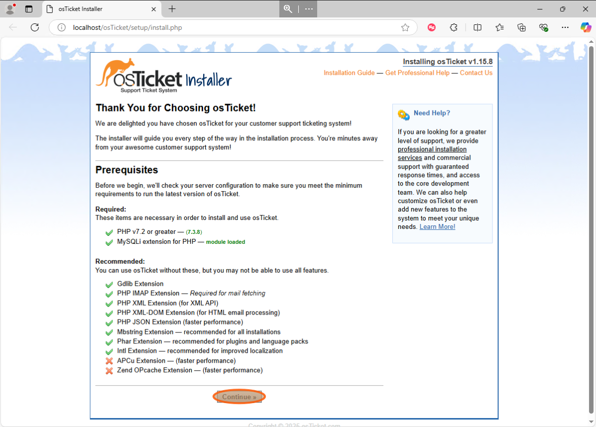
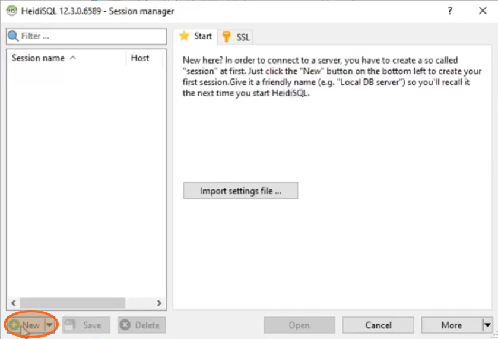

# 

 

<h1>osTicket: Prerequisites and Installation</h1>

## Description

This project provides a comprehensive, step-by-step guide for implementing a scalable, open-source Help Desk solution using osTicket on Microsoft Azure.

It covers creating a Windows 10 VM, configuring a full web server environment (IIS, MySQL, PHP), and overcoming technical challenges with PHP modules, IIS permissions, and configuration conflicts.

The result is a documented process for creating a production-ready osTicket instance, demonstrating skills in system administration, web server configuration, and technical documentation.

Before you start, consider having an Azure account (with an active subscription) and basic knowledge of Azure (portal navigation, resource creation). To make it easier to reproduce this configuration, all the necessary installation files are available [here](https://drive.usercontent.google.com/download?id=1b3RBkXTLNGXbibeMuAynkfzdBC1NnqaD&export=download&authuser=0).
 

## Environments and Utilities Used

-   **Microsoft Azure**
-   **Virtual Machines**
-   **Remote Desktop Connection**
-   **Internet Information Services**
-   **MySQL**

## Operating Systems Used

-   **Windows 10**

## Index

1.  [Creating our virtual machine in Azure](https://github.com/HeidiBolivar/osticket-prereqs/edit/main/README.md#creating-our-virtual-machine-in-azure)
2.  [Establishing connection with the virtual machine implementing Remote Desktop Protocol](https://github.com/HeidiBolivar/osticket-prereqs/edit/main/README.md#establishing-connection-with-the-virtual-machine-implementing-remote-desktop-protocol)
3.  [Creating the environment for the ticketing system](https://github.com/HeidiBolivar/osticket-prereqs/edit/main/README.md#creating-the-environment-for-the-ticketing-system)
4.  [Adapting our web server](https://github.com/HeidiBolivar/osticket-prereqs/edit/main/README.md#adapting-our-web-server)
5.  [Setting up osTicket](https://github.com/HeidiBolivar/osticket-prereqs/edit/main/README.md#setting-up-osticket)

## Project Walk-through:

### Creating our virtual machine in Azure

1.  The first step is to navigate to the Microsoft Azure portal, which can be found [here](https://portal.azure.com/#home). 

2.  Within the portal, locate the field titled "**Search resources, services, and docs (G+/)**" and enter the search term "**vm**". Click on "**Virtual machines**" in the resulting list. 

    

3.  The following steps should be taken in order to create a virtual machine: firstly, click on "**Create**" > "**Azure virtual machine**". 

    
    

4.  Then, click on "**Create new**" > click on the "**Name**" field > type "**osTicket**" > click on "**OK**". 

    
    
    

5.  Assign a name to the VM by clicking on the "**Virtual machine name**" field and typing "**osticket-vm**". 

    

6.  Click on "**Region settings**" and select "**East US 2**". 

    
    

7.  Select the virtual machine image and choose the "**Windows 10 Pro, version 22H2 - x64 Gen2**" option. 

    
    

8.  Click on the field marked as "**Username**". Here, a username must be typed and set up. 

    

9.  Click on the field marked as "**Password**" and then enter and set up a password. 

    

10. Click on the "**Confirm Password**" box and enter the password again. 

    

11. The "**Licensing**" box must be checked. 

    

12. Click on the option titled "**Review + Create**". 

    

13. Following the conclusion of the review process, the subsequent step is to click the "**Create**" button. 

    

 

### Establishing connection with the virtual machine implementing Remote Desktop Protocol

14. Download [Microsoft Remote Desktop](https://apps.microsoft.com/detail/9wzdncrfj3ps?hl=es=EN&gl=EN). If you are using a Windows computer, look for "**Remote Desktop**" in the Applications list. 

15. To establish a remote connection to the virtual machine, it is necessary to download this software to facilitate the process. 

    

16. In the Azure Portal, click the search box, type "**VM**", and click "**Virtual Machines**". 

    

17. Identify the "**public IP address**" of our virtual machine (`74.249.118.131`) and copy it by pressing `[[ctrl]]` + `[[c]]`. 

    

18. Open "**Remote Desktop**". 

    

19. Click "**Add**" > Click "**PC**" to enter our virtual machine information. 

    
    

20. Click on "**Formal name or IP address**" and paste the IP address using `[[ctrl]]` + `[[v]]`. 

    

21. Click the "**Display name**" section and enter a name for this PC. 

    

22. Save the information. 

    

23. Open your new PC. 

    

 

### Creating the environment for the ticketing system

24. Enter the username and password assigned to your virtual machine during Azure configuration and click **Connect**. 

    

25. Configuring the virtual machine windows. 

    

26. Open "**Microsoft Edge**" on the virtual machine. 

    

27. Download [osTicket-Installation-Files.zip](https://drive.usercontent.google.com/download?id=1b3RBkXTLNGXbibeMuAynkfzdBC1NnqaD&export=download&authuser=0). This is an archive containing all the applications and dependencies required to install, configure, and run the ticketing system correctly. 

    

28. Open "**File Explorer**". 

    

29. Open the "**Download**" folder. 

    

30. Extract "**osTicket-Installation-Files**". 

    

31. Open "**Control panel**". 

    

32. Click "**Uninstall**", then click "**Turn Windows features on or off**". 

    
    

33. Enable the "**CGI**" feature. 

    

34. We can test that the web server is installed correctly by entering the loopback IP (`127.0.0.1`) in the web browser, and this page should load. 

    

35. Navigate to the "**osTicket-Installation-Files**" folder in File Explorer. 

    

36. Install PHP Manager for IIS Setup: "**PHPManagerForIIS_V1.5.0**". 

    

37. Install the IIS URL Rewrite module: "**rewrite_amd64_en-US**". 

    

38. Create a folder called "**PHP**" in "**C:\\**". 

    

39. Extract "**php-7.3.8-nts-Win32-VC15-x86**" to the "**PHP**" folder. 

    

40. Download Microsoft Visual C++: "**VC_redist.x86**". 

    

41. Download MySQL: "**mysql-5.5.62-win32**", selecting the "**typical**" configuration. 

    
    

42. Select the "**Standard**" option. 

    

43. Click the "**Next**" button. 

    

44. Click the "**Next**" button. 

    

45. Set up your credentials. 

    

46. Click the "**Finish**" button. 

    

 

### Adapting our web server

47. Open "**IIS**" as an administrator. 

    

48. Go to "**PHP Manager**". 

    

49. Click "**Register new PHP version**". 

    

50. Click "`...`". 

    

51. Go to "**C:\\PHP**" and open "**php-cgi**". 

    

52. Stop and start the server. 

    

53. Extract "**osTicket-v1.15.8**". 

    

54. Cut the folder "**Upload**". 

    

55. Paste it into "**C:\\inetpub\\wwwroot**". 

    

56. Rename "**upload**" to "**osTicket**". 

    

57. Stop the server and restart it one more time. 

    

58. Go to the "**osTicket**" folder. 

    

59. Click "**Browse *:80 (http)**" on the right-hand side. 

    

    This page should open: 

    

60. Go to the "**osTicket > PHP Manager**" section. 

    

61. Click on the "**Enable or disable extension**" button. 

    

62. Enable "**php_imap.dll**", "**php_intl.dll**", and "**php_opcache.dll**". 

    

63. Refresh the osTicket page and note the changes here. 

    

64. In "**C:\\inetpub\\wwwroot\\osTicket\\include**", change the file "**ost-sampleconfig.php**" to "**ost-config.php**". 

    

65. Enter the properties of the "**ost-config.php**" file. 

    

66. Press the "**Security**" button. 

    

67. Click on "**Advanced**". 

    

68. Remove all inherited permissions from this object. 

    

69. Click the "**Add**" button. 

    

70. Click on "**Select a principal**". 

    

71. Click here and type in "**Everyone**". 

    

72. Click on the "**Check names**" button. 

    

73. Press "**OK**". 

    

74. Click on "**Full control**". 

    

75. Click "**OK**". 

    

76. Click the "**Apply**" button. 

    

77. Press "**OK**". 

    

78. Click "**OK**". 

    

79. On the osTicket web page, click "**Continue**". 

    

 

### Setting up osTicket

80. Fill in the "**Admin user**" and "**System settings**" fields. 

    

81. Before establishing the database, connecting to it using HeidiSQL is necessary. **Install HeidiSQL** and retain the default settings. 

    

82. In HeidiSQL, click on "**New**". 

    

83. Type in your root password (the password from the MySQL setup).
    
    
    
84.  Click the "**Open**" button. 
    
     
    
85. Click on "**Database**". 

    

86. Type "**osTicket**" and click "**OK**". 

    

87. Fill in the "**Database settings**" field. 

    

88. Click "**Install**". 

    

 

## Successfully Installed osTicket! What"s Next?

**By following the steps outlined in this comprehensive guide, you have now successfully installed osTicket and have it ready to use! But the setup doesn't end here. osTicket is now installed and ready for use! In the next project, I will extend this foundation by providing a detailed walkthrough on configuring agents (including their permissions and access levels), managing users, and exploring other key configuration options to tailor osTicket to specific support workflows.**

Next: [osTicket: Post-Installation Configuration](https://github.com/HeidiBolivar/post-install-config)
</b>

Thank you 😊 for taking the time to explore 🔎 this project, it's great to see someone so engaged and curious 💡. Connect with me on [LinkedIn](https://www.linkedin.com/in/heidibolivar/) 🤝 and let's see what we can build together ✨.
 
 
